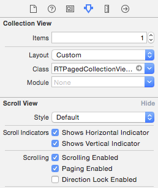
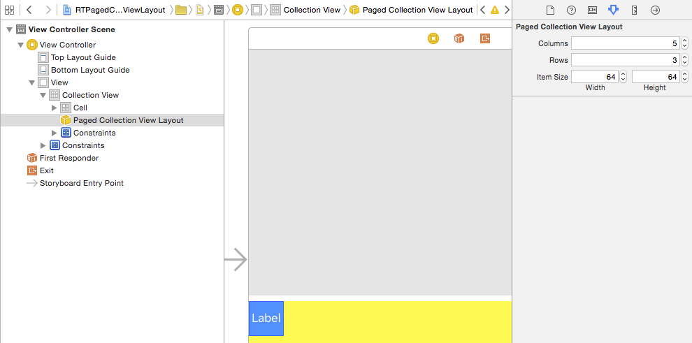
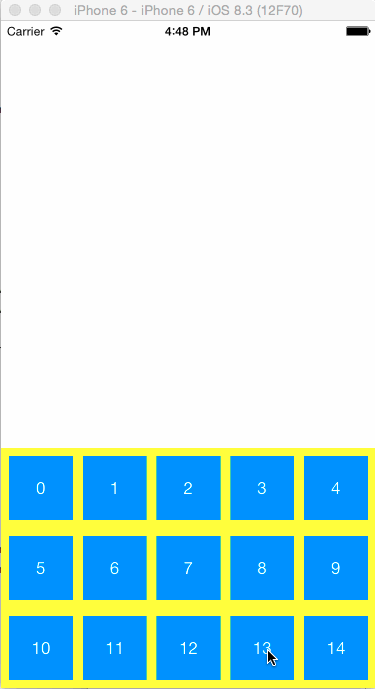

# RTPagedCollectionViewLayout

[](https://travis-ci.org/rickytan/RTPagedCollectionViewLayout)
[](http://cocoapods.org/pods/RTPagedCollectionViewLayout)
[](http://cocoapods.org/pods/RTPagedCollectionViewLayout)
[](http://cocoapods.org/pods/RTPagedCollectionViewLayout)

## Usage

To run the example project, clone the repo, and run `pod install` from the Example directory first.

### With Interface builder

1. Setup custom `UICollectionViewLayout`

   

   Setup params

   

### With Code

```objective-c
- (void)viewDidLoad
{
    [super viewDidLoad];
	// Do any additional setup after loading the view, typically from a nib.
    CGFloat width = self.view.bounds.size.width;
    RTPagedCollectionViewLayout *layout = [[RTPagedCollectionViewLayout alloc] init];
    layout.columns = 3;
    layout.rows = 2;
    layout.itemSize = CGSizeMake(30, 30);
    UICollectionView *collectionView = [[UICollectionView alloc] initWithFrame:CGRectMake(0, 0, width, 240)
                                                          collectionViewLayout:layout];
    [self.view addSubview:collectionView];
}
```

## ScreenShot



## Requirements

* **iOS 6** and up

## Installation

RTPagedCollectionViewLayout is available through [CocoaPods](http://cocoapods.org). To install
it, simply add the following line to your Podfile:

```ruby
pod "RTPagedCollectionViewLayout"
```

## Author

Ricky Tan, <ricky.tan.xin@gmail.com>

## License

RTPagedCollectionViewLayout is available under the MIT license. See the LICENSE file for more info.